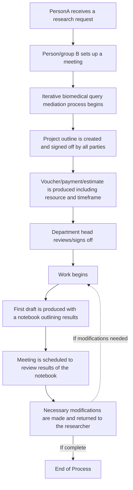
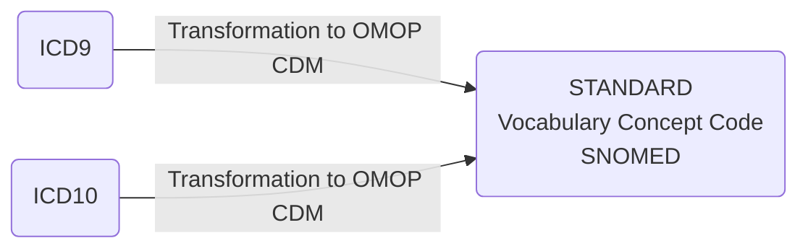

<h1>Welcome to my training material test lab and Markdown "sampler"! </h1>

### Where I share fabulous data science resources while teaching myself new ways to present information using Markdown!!

# Table of Contents

- [OHDSI_Resources](#ohdsi-resources]
- [OMOP CDM Basic Data Dictionary](#omop-cdm-basic-data-dictionary)
- [Projects Best Suited for Observational Research and OHDSI Network Studies](#projects-best-suited-for-observational-research-and-ohdsi-network-studies)
- [Analytic Use Cases and Examples](#analytic-use-cases-and-examples)
- [Incremental Loading](#incremental-loading)
- [The Collaboration Process](#the-collaboration-process)
- [Current CDM](#current-cdm)
- [Commonly Used CDM Tables Overview](#commonly-used-cdm-tables-overview)
- [OHDSI Analysis Tools](#ohdsi-analysis-tools)
- [Data Science Handbook](#data-science-handbook)
- [Jupyter Notebooks and programming](#jupyter-notebooks-and-programming)
- [Recommended Trainings](#recommended-trainings)
- [Python, SQL, and R Programming Resources](#python-sql-and-r-programming-resources)
- [Analysis with SQL](#analysis-with-sql)
- [Analysis with R](#analysis-with-r)


# OMOP CDM Basic Data Dictionary 
For a sample interactive OMOP data dictionary, please click on the image below:
[](https://dbjhu.github.io/OMOPDD.html)
<div style="text-align: right"><a href="#table-of-contents">Back to Table of Contents</a></div>

# Projects Best Suited for Observational Research and OHDSI Network Studies
 

<div style="text-align: right"><a href="#table-of-contents">Back to Table of Contents</a></div>

# (This is the exact same table as in the image above only in Markdown)

## Analytic Use Cases and Examples

| Analytic use case                     | Type                        | Structure                                                                                                               | Example                                                                                                                   |
|---------------------------------------|-----------------------------|-------------------------------------------------------------------------------------------------------------------------|---------------------------------------------------------------------------------------------------------------------------|
| **Clinical characterization**         | Disease Natural History     | Amongst patients who are diagnosed with `<insert your favorite disease>`, what are the patient’s characteristics from their medical history? | Amongst patients with rheumatoid arthritis, what are their demographics (age, gender), prior conditions, medications, and health service utilization behaviors? |
|                                       | Treatment utilization       | Amongst patients who have `<insert your favorite disease>`, which treatments were patients exposed to amongst `<list of treatments for disease>` and in which sequence? | Amongst patients with depression, which treatments were patients exposed to SSRI, SNRI, TCA, bupropion, esketamine and in which sequence? |
|                                       | Outcome incidence           | Amongst patients who are new users of `<insert your favorite drug>`, how many patients experienced `<insert your favorite known adverse event from the drug profile>` within `<time horizon following exposure start>`? | Amongst patients who are new users of methylphenidate, how many patients experienced psychosis within 1 year of initiating treatment? |
| **Population-level effect estimation** | Safety surveillance         | Does exposure to `<insert your favorite drug>` increase the risk of experiencing `<insert an adverse event>` within `<time horizon following exposure start>`? | Does exposure to ACE inhibitor increase the risk of experiencing Angioedema within 1 month after exposure start? |
|                                       | Comparative effectiveness   | Does exposure to `<insert your favorite drug>` have a different risk of experiencing `<insert any outcome (safety or benefit)>` within `<time horizon following exposure start>`, relative to `<insert your comparator treatment>`? | Does exposure to ACE inhibitor have a different risk of experiencing acute myocardial infarction while on treatment, relative to thiazide diuretic? |
| **Patient level prediction**          | Disease onset and progression | For a given patient who is diagnosed with `<insert your favorite disease>`, what is the probability that they will go on to have `<another disease or related complication>` within `<time horizon from diagnosis>`? | For a given patient who is newly diagnosed with atrial fibrillation, what is the probability that they will go onto to have ischemic stroke in next 3 years? |
|                                       | Treatment response           | For a given patient who is a new user of `<insert your favorite chronically-used drug>`, what is the probability that they will `<insert desired effect>` in `<time window>`? | For a given patient with T2DM who start on metformin, what is the probability that they will maintain HbA1C <6.5% after 3 years? |
|                                       | Treatment safety             | For a given patient who is a new user of `<insert your favorite drug>`, what is the probability that they will experience `<insert adverse event>` within `<time horizon following exposure>`? | For a given patient who is a new user of warfarin, what is the probability that they will have GI bleed in 1 year? |

<div style="text-align: right"><a href="#table-of-contents">Back to Table of Contents</a></div>

## Important Paper About Implementation of the OMOP CDM!
[Erica A Voss, Clair Blacketer, Sebastiaan van Sandijk, Maxim Moinat, Michael Kallfelz, Michel van Speybroeck, Daniel Prieto-Alhambra, Martijn J Schuemie, Peter R Rijnbeek, European Health Data & Evidence Network—learnings from building out a standardized international health data network, Journal of the American Medical Informatics Association, 2023;, ocad214](https://doi.org/10.1093/jamia/ocad214)

<div style="text-align: right"><a href="#table-of-contents">Back to Table of Contents</a></div>

## Incremental Loading

Incremental loading in the context of OHDSI refers to the process of adding new or updated data to an existing OHDSI database without the need to completely rebuild or refresh the entire dataset. This can be particularly useful for large datasets where full loads can be time-consuming and inefficient. The process involves extracting only the changes since the last load and then transforming and loading this delta of data into the existing OMOP Common Data Model (CDM) used by OHDSI tools.

For instance, in the development of an ETL (Extract, Transform, Load) process for the bulk and incremental load of German patient data into the OMOP CDM using FHIR as referenced by OHDSI, it suggests that the incremental loading is an essential part of keeping the database up-to-date in an efficient manner​. [OHDSI Symposium Showcase #44](https://ohdsi.org/2021-global-symposium-showcase-44/#:~:text=,Reinecke%2C%20Michele%20Zoch%2C%20Martin%20Sedlmayr)

This group alos described a [Near Real-Time Incremental OMOP-CDM ETL System](https://www.ohdsi.org/wp-content/uploads/2021/09/14-abstract-lee.pdf)

This is also described by Dr. DuWayne Willett, CMIO of UTSW, at around minute 30 of this video:

[](https://www.youtube.com/watch?v=DPatSxFkIpI "OHDSI Symposium Presentation by Dr. DuWayne Willett")

...and in this OHDSI symposium presentation: .

<div style="text-align: right"><a href="#table-of-contents">Back to Table of Contents</a></div>


## The Collaboration Process 
### This is just an example of the kinds of diagrams we can make in Mermaid for our workflows


<div style="text-align: right"><a href="#table-of-contents">Back to Table of Contents</a></div>

#
## Current CDM


*Source: [OHDSI Common Data Model](https://ohdsi.github.io/CommonDataModel/index.html)*

<div style="text-align: right"><a href="#table-of-contents">Back to Table of Contents</a></div>


[Interactive (Select) OMOP Data Dictionary](https://github.com/DBJHU/DBJHU.github.io/blob/main/SelectOMOPDataDictionaryInteractivev2.html)

<div style="text-align: right"><a href="#table-of-contents">Back to Table of Contents</a></div>

# Commonly Used CDM Tables Overview
The OMOP common data model (CDM) is a relational database made up of different tables that relate to each other by foreign keys (XXXX_ID values; e.g., PERSON_ID or PROVIDER_ID). The OMOP tables in your data export are as follows:

| Table              | Description |
|--------------------|---------------------|
| Person             | Contains basic demographic information describing a participant, including biological sex, birth date, race, and ethnicity. |
| Visit_occurrence   | Captures encounters with healthcare providers or similar events. Contains the type of visit a person has (outpatient care, inpatient care, or long-term care), as well as the date and duration information. Rows in other tables can reference this table, for example, condition_occurrences related to a specific visit. |
| Condition_occurrence | Indicates the presence of a disease or medical condition stated as a diagnosis, a sign, or symptom, which is either observed by a provider or reported by the patient. |
| Drug_exposure      | Captures records about the utilization of a medication. Drug exposures include prescription and over-the-counter medicines, vaccines, and large-molecule biologic therapies. Radiological devices ingested or applied locally do not count as drugs. Drug exposure is inferred from clinical events associated with orders, prescriptions written, pharmacy dispensing, procedural administrations, and other patient-reported information. |
| Measurement        | Contains both orders and results of a systematic and standardized examination or testing of a participant or participant's sample, including laboratory tests, vital signs, quantitative findings from pathology reports, etc. |
| Procedure_occurrence | Contains records of activities or processes ordered by or carried out by a healthcare provider on the patient to have a diagnostic or therapeutic purpose. |
| Observation        | Captures clinical facts about a person obtained in the context of an examination, questioning, or a procedure. Any data that cannot be represented by another domain, such as social and lifestyle facts, medical history, and family history, are recorded here. |
| Device_exposure    | Captures information about a person's exposure to a foreign physical object or instrument which is used for diagnostic or therapeutic purposes. Devices include implantable objects, blood transfusions, medical equipment and supplies, other instruments used in medical procedures, and material used in clinical care. |
| Death              | Contains the clinical events surrounding how and when a participant dies. |

<div style="text-align: right"><a href="#table-of-contents">Back to Table of Contents</a></div>


<div style="text-align: right"><a href="#table-of-contents">Back to Table of Contents</a></div>


| Domain                    | Source Vocabulary              | Standard Vocabulary       |
|---------------------------|--------------------------------|---------------------------|
| Conditions                | ICD9, ICD10                    | SNOMED                    |
| Measurements              | LOINC or institutional specific codes | LOINC               |
| Drugs                     | NDC                            | RxNORM                    |
| Procedures                | ICD9, ICD10, CPT               | SNOMED                    |   |

* ICD = International Classification of Diseases
* SNOMED = Systematized Nomenclature of Medicine
* LOINC = Logical Observation Identifiers Names and Codes
* NDC = National Drug Code
* CPT = Current Procedural Terminology

  <div style="text-align: right"><a href="#table-of-contents">Back to Table of Contents</a></div>


# OHDSI Analysis Tools
R, SQL, Python, or any preferred data analysis software. Examples provided below are for R and SQL.
[The Book of OHDSI Chapter 9] (https://ohdsi.github.io/TheBookOfOhdsi/SqlAndR.html) provides an overview of analysis of OHDSI data in R and SQL; note that you will not be able to avail yourselves of OHDSI software tools when analyzing your exported data for the reason explained above.

<div style="text-align: right"><a href="#table-of-contents">Back to Table of Contents</a></div>

## Data Science Handbook
[Open, rigorous and reproducible research: A practitioner’s handbook](https://datascience.stanford.edu/programs/stanford-data-science-scholars-program/data-science-handbook) 
From Standord Data Science

<div style="text-align: right"><a href="#table-of-contents">Back to Table of Contents</a></div>

## Programming Resources:  Jupyter Notebooks, Python, SQL, and R Programming Resources

- [Project Jupyter](https://jupyter.org/)
- [What is the Jupyter Notebook?](https://jupyter-notebook-beginner-guide.readthedocs.io/en/latest/what_is_jupyter.html)
- [NIAID NIH Informatics resources](https://bioinformatics.niaid.nih.gov/resources)

Software Carpentry is a website that provides free online lessons to researchers wanting to enhance their programming skills for data analysis. This website offers free online lessons on a variety of useful topics including:

- [Programming with Python](http://swcarpentry.github.io/python-novice-inflammation/)
- [Programming with R](http://swcarpentry.github.io/r-novice-inflammation/)
- [Databases and SQL](http://swcarpentry.github.io/sql-novice-survey/)

Additional resources:

- [DataCamp](http://www.datacamp.com/)
- [Khan Academy](https://www.khanacademy.org/computing/computer-programming/sql/sql-basics/v/welcome-to-sql)
- [Codecademy - Learn Python 2](https://www.codecademy.com/learn/learn-python)
- [Python Data Science Handbook](https://jakevdp.github.io/PythonDataScienceHandbook/)
- [R for Data Science](https://r4ds.had.co.nz/)
- [Introduction to Programming (NIAID, NIH)](https://bioinformatics.niaid.nih.gov/resources - 70.3.1)
- [Python Programming (NIAID, NIH)](https://bioinformatics.niaid.nih.gov/resources - 70.3.2)
- [Data Analysis with Python and Pandas (NIAID, NIH)](https://bioinformatics.niaid.nih.gov/resources - 70.3.3)
- [Data Visualization with Python (NIAID, NIH)](https://bioinformatics.niaid.nih.gov/resources - 70.3.4)
- [Source:NIH All of US Study](https://support.researchallofus.org/hc/en-us/articles/360039690191-Jupyter-Notebooks-and-programming)

<div style="text-align: right"><a href="#table-of-contents">Back to Table of Contents</a></div>

# OHDSI Resources
Hello! Please familiarize yourself with the following tools and resources which will help you throughout this course and your OHDSI journey.

Check out the [**OHDSI Forums**](https://forums.ohdsi.org/) *Introduce yourself on the "Welcome to OHDSI" thread.*

Bookmark [**The Book of OHDSI**](https://ohdsi.github.io/TheBookOfOhdsi/)

Check out [**OHOP CDM FAQ**](https://ohdsi.github.io/CommonDataModel/faq.html)

Join the OHDSI [**Microsoft Teams**](https://forms.office.com/Pages/ResponsePage.aspx?id=lAAPoyCRq0q6TOVQkCOy1ZyG6Ud_r2tKuS0HcGnqiQZUQ05MOU9BSzEwOThZVjNQVVFGTDNZRENONiQlQCN0PWcu) environment.

Check out the [**MIMIC-IV demo data set**](https://physionet.org/content/mimic-iv-demo-omop/0.9/1_omop_data_csv/) in OMOP CDM format!

Register with [**EHDEN Academy**](https://academy.ehden.eu/)

Visit the [**Atlas Demo**](https://atlas-demo.ohdsi.org/) and [**Athena**](https://athena.ohdsi.org/search-terms/start).

Bookmark the [**OHDSI YouTube tutorials and workshops**](https://youtube.com/playlist?list=PLpzbqK7kvfeXRQktX0PV-cRpb3EFA2e7Z)

Visit the [**OHDSI Community Dashboard**](https://dash.ohdsi.org/)

Bookmark [**OMOP Common Data Model (ohdsi.github.io)**](https://ohdsi.github.io/CommonDataModel/index.html)

[**Learn about GitHub**](https://docs.github.com/en/get-started/quickstart/hello-world) if you don't already know.

Plan to attend an [**OHDSI Community call**](https://ohdsi.org/community-calls/)

Learn about OHDSI [**Workgroups**](https://ohdsi.org/upcoming-working-group-calls/)

Follow OHDSI on social media: [**Twitter**](https://twitter.com/OHDSI) [**LinkedIn**](https://www.linkedin.com/company/ohdsi)

[**Subscribe**](https://ohdsi.org/subscribe-to-our-newsletter/) to the OHDSI Newsletter

Learn about past and [**upcoming OHDSI events**](https://ohdsi.org/2023-ohdsi-events/)

Learn about OHDSI [**software**](https://ohdsi.org/software-tools/)

Look up individual concepts in [Athena](https://athena.ohdsi.org/)

Check out useful OHDSI-related documentation here: [NIH ALL of US OMOP Documentation](https://support.researchallofus.org/hc/en-us/articles/360039585391-How-the-Observational-Medical-Outcomes-Partnership-OMOP-vocabulary-are-structured)

<div style="text-align: right"><a href="#table-of-contents">Back to Table of Contents</a></div>

# Recommended Trainings
## OHDSI Community
  **Broadsea3.0**  
  By: Lee Evans  
 [](https://youtu.be/CNlsZzY7VrM)


<div style="text-align: right"><a href="#table-of-contents">Back to Table of Contents</a></div>

## Tufts Bridge2AI Standards Module
- **June 15, 2023:**  
  **Data Quality Dashboard**  
  By: Jared Houghtaling  
  [](https://youtu.be/O2L1x0Sv3lc)

- **July 6, 2023:**  
  **Data Quality Dashboard output demo**  
  By: Jared Houghtaling  
  [](https://youtu.be/qYDq5-dg-io)

- **July 13, 2023:**  
  **Achilles output demo**  
  By: Jared Houghtaling  
  [](https://youtu.be/bIRQVgcnAwI)

- **July 27, 2023:**  
  **Flowsheet follow-up**  
  By: Polina Talapova & Jared Houghtaling  
  [](https://youtu.be/3cTT2XJZslI)

- **August 3, 2023:**  
  **OMOP Standardized Vocabularies - Part 1**  
  By: Jared Houghtaling and Polina Talapova  
  [](https://youtu.be/4xnH7-oJxyo)

- **August 17, 2023:**  
  **OMOP Standardized Vocabularies - Part 2**  
  By: Polina Talapova  
  [](https://youtu.be/1J7ISUASx6k)

- **August 24, 2023:**  
  **How to download and set-up a DDL (Demo)**  
  By: Jared Houghtaling  
  [](https://youtu.be/x9W3sa1xGoQ)

- **August 31, 2023:**  
  **Demo of WhiteRabbit and RabbitInAHat**  
  By: Jared Houghtaling  
  [](https://youtu.be/gu1fQVwkBo8)

- **September 7, 2023:**  
  **ARES usefulness for ETL at Tufts**  
  By: Jared Houghtaling  
  [](https://youtu.be/Czox3WT1pDM)

- **September 14, 2023:**  
  **Google form introduction for site progress tracking**  
  By: Jared Houghtaling  
  [](https://youtu.be/ntZwikqhIcM)

- **September 21, 2023:**  
  **Sample ETL Process**  
  By: Jared Houghtaling  
  [](https://youtu.be/uX289BrzXM4)

**October 12, 2023:**  
  **Google Form for Site Progress Tracking**  
  With Jared Houghtaling and Andrew Williams  
  [](https://youtu.be/oTP6ISo8FWc)

- **October 26, 2023:**  
  **Review and Prioritization of DQD Results, and Discussion of DQD Issue Severity**  
  With Jared Houghtaling  
  [](https://youtu.be/dJr5tkm-Ex4)

- **November 2, 2023:**  
  **Principles of Mapping and Vocab Gaps Identification**  
  With Polina Talapova  
  [](https://youtu.be/jOKzb3x6hmo)

- **November 9, 2023:**  
  **Usagi & STCM Demo**  
  With Polina Talapova & Jared Houghtailing  
  [](https://youtu.be/hNhph-elrp4)


<div style="text-align: right"><a href="#table-of-contents">Back to Table of Contents</a></div>

## Analysis with SQL (OHDSI/OMOP)

The [OMOP Query Library](https://data.ohdsi.org/QueryLibrary/) is a library of commonly-used SQL queries for the OMOP Common Data Model (CDM).


## Analysis with R
Below are some sample R queries that demonstrate how to read in OMOP tables from CSV files, join them based on the `person_id` and `visit_occurrence_id` fields, and search for specific criteria.

Note: Adjust the file paths and column names accordingly based on the actual structure and location of your CSV files. The queries below are a generic representation and may need adjustments based on the specifics of your data set.

### Reading CSV files into R data frames:

```R
# Read the CSV files into R data frames
person_df <- read.csv("path_to_person_table.csv", header=TRUE, stringsAsFactors=FALSE)
visit_occurrence_df <- read.csv("path_to_visit_occurrence_table.csv", header=TRUE, stringsAsFactors=FALSE)
condition_occurrence_df <- read.csv("path_to_condition_occurrence_table.csv", header=TRUE, stringsAsFactors=FALSE)
```
Join tables based on `person_id`:

When a person has multiple visits in the `visit_occurrence` table, joining the `person` table with the `visit_occurrence` table will result in multiple rows for that person, each corresponding to a different visit. This is a standard one-to-many join operation.

```R
## Join person with visit_occurrence on 'person_id'
person_visit_df <- merge(person_df, visit_occurrence_df, by="person_id")
```

### Joining the Person-Visit table with the Condition Occurrence table:

```R
# Join the person-visit result with condition_occurrence on both 'person_id' and 'visit_occurrence_id'
full_df <- merge(person_visit_df, condition_occurrence_df, by=c("person_id", "visit_occurrence_id"))
```

### Search by a list of `person_ids`:

```R
# Define a list of person_ids to search for
search_person_ids <- c(1, 2, 3, 4, 5)

# Filter the data frame to only include rows with person_ids in the list
filtered_by_person_df <- subset(full_df, person_id %in% search_person_ids)
```

### Search by a specific condition concept code:

```R
# Define a specific condition concept code to search for
search_condition_concept_id <- 1234567

# Filter the data frame to only include rows with the specified condition concept code
filtered_by_condition_df <- subset(full_df, condition_concept_id == search_condition_concept_id)
```

### Search by a date range:

```R
# Define a date range to search for
start_date <- as.Date("2020-01-01")
end_date <- as.Date("2020-12-31")

## Filter the data frame to only include rows within the date range
filtered_by_date_df <- subset(full_df, visit_start_date >= start_date & visit_start_date <= end_date)
```
<!--TBD
## Analysis with Python 

### Required Python Libraries:

To execute the Python queries, you'll need to install the pandas library. -->


<div style="text-align: right"><a href="#table-of-contents">Back to Table of Contents</a></div>
<!--- WIP 

# OMOP ETL Process: Common Problems and Solutions

## Design and Planning
| Problem | Suggestion |
| ------- | ---------- |
| Different Coding Schemes in Databases | Standardize structures, conventions, and content during ETL to align different coding schemes. |
| Designing ETL with Expert Collaboration | Collaborate between data and CDM experts for efficient design. |
| Inadequate Source Data Documentation | Use White Rabbit to scan and understand source data thoroughly. |
| Mapping Source Data to CDM | Use Rabbit-in-a-Hat tool for interactive mapping and documentation. |
| Mapping Non-OMOP Coding Systems | Focus on frequently used codes and utilize existing mappings where possible. |
| Handling Post Coordinated SNOMED Codes | Address challenges with codes or conditions occurring multiple times. |
| Integration of New Data Sources | Develop a flexible ETL process to integrate new data sources. |
| Handling Various Data Formats | Create processes to handle different data formats effectively. |
| Custom Code Development for ETL | Develop custom code when necessary for specific ETL requirements. |
| Adapting to CDM Updates | Adapt ETL processes to accommodate updates in the CDM. |

## Implementation and Technology
| Problem | Suggestion |
| ------- | ---------- |
| ETL Implementation | Utilize existing code and community resources for efficient ETL process implementation. |
| Choosing ETL Implementation Technology | Select technology based on site expertise (SQL, SAS, C#, Java, etc.). |
| Data Transformation Logic | Clearly define and document the logic for data transformations. |
| ETL Performance Optimization | Continuously monitor and optimize ETL performance. |
| Scalability of ETL Processes | Ensure that ETL processes are scalable to accommodate growing data. |
| Data Mapping Complexities | Address complexities in mapping data from various sources to the CDM. |
| Updating and Maintenance of ETL Scripts | Regularly update and maintain ETL scripts for consistency. |
| Managing ETL Dependencies | Identify and manage dependencies in the ETL process. |
| Cross-Database Compatibility | Ensure compatibility of ETL processes across different databases. |
| Optimizing Data Load Processes | Optimize data load processes to enhance performance. |

## Data Quality and Security
| Problem | Suggestion |
| ------- | ---------- |
| Data Quality Issues | Implement thorough quality control measures to ensure data integrity. |
| Large Dataset Handling | Optimize ETL processes for handling large datasets efficiently. |
| Missing or Incomplete Data | Develop strategies to handle missing or incomplete data elements. |
| Handling Data Anomalies | Develop procedures to identify and resolve data anomalies. |
| Data Security and Compliance | Maintain strict adherence to data security and compliance standards. |
| Data Validation Processes | Implement robust data validation processes to ensure accuracy. |
| Error Handling in ETL Process | Develop comprehensive error handling mechanisms. |
| Source Data Version Control | Maintain version control for source data to track changes. |
| Data Cleansing Procedures | Establish data cleansing procedures to improve data quality. |
| Complex Transformation Rules | Manage complex transformation rules efficiently. |

## Operational Management
| Problem | Suggestion |
| ------- | ---------- |
| Automation of ETL Processes | Explore opportunities to automate repetitive ETL tasks. |
| Resource Allocation for ETL Tasks | Allocate sufficient resources for ETL tasks. |
| Maintaining Data Lineage | Keep track of data lineage throughout the ETL process. |
| Balancing ETL Speed and Accuracy | Balance the need for speed with accuracy in ETL processes. |
| Training for ETL Team | Provide comprehensive training for the ETL team. |
| Standardizing ETL Practices | Standardize ETL practices across various projects. |
| Monitoring ETL Processes | Implement monitoring tools to oversee ETL processes. |
| Dealing with Data Duplication | Develop strategies to handle data duplication issues. |
| Dynamic Data Source Integration | Integrate dynamic data sources effectively into the ETL process. |
| Data Transformation Standardization | Standardize data transformation rules across different datasets. |
| Collaboration and Communication | Foster collaboration and communication among all stakeholders involved in the ETL process. | 
-->
