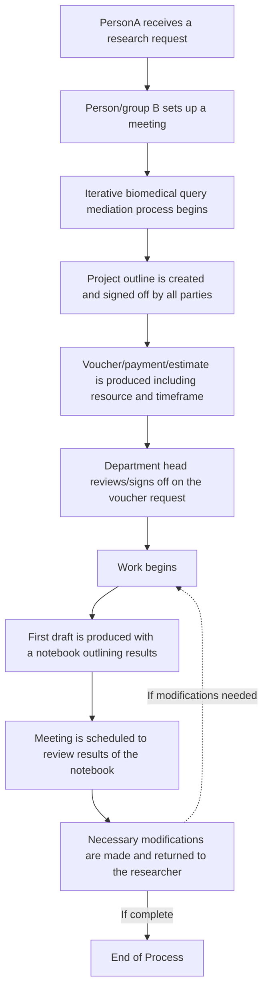
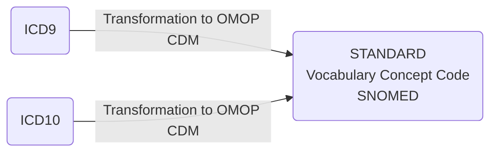

<!DOCTYPE html>
<html>
<body>
<h1>Hello!</h1>
<p>Welcome to my training material test lab!  I'm hosted with GitHub Pages.</p>
</body>
</html>

# Introduction

# Projects Best Suited for Observational Research and OHDSI Network Studies
 

## The Collaboration Process 
### This is just an example of the kinds of diagrams we can make


# 
## Current CDM


*Source: [OHDSI Common Data Model](https://ohdsi.github.io/CommonDataModel/index.html)*

[Interactive (Select) OMOP Data Dictionary](https://github.com/DBJHU/DBJHU.github.io/blob/main/SelectOMOPDataDictionaryInteractivev2.html)



| Domain                    | Source Vocabulary              | Standard Vocabulary       |
|---------------------------|--------------------------------|---------------------------|
| Conditions                | ICD9, ICD10                    | SNOMED                    |
| Measurements              | LOINC or institutional specific codes | LOINC               |
| Drugs                     | NDC                            | RxNORM                    |
| Procedures                | ICD9, ICD10, CPT               | SNOMED                    |   |

* ICD = International Classification of Diseases
* SNOMED = Systematized Nomenclature of Medicine
* LOINC = Logical Observation Identifiers Names and Codes
* NDC = National Drug Code
* CPT = Current Procedural Terminology

# Analysis Tools
R, SQL, Python, or any preferred data analysis software. Examples provided below are for R and SQL.
[The Book of OHDSI Chapter 9] (https://ohdsi.github.io/TheBookOfOhdsi/SqlAndR.html) provides an overview of analysis of OHDSI data in R and SQL; note that you will not be able to avail yourselves of OHDSI software tools when analyzing your exported data for the reason explained above.
<
## Jupyter Notebooks and programming
[Source:NIH All of US Study] (https://support.researchallofus.org/hc/en-us/articles/360039690191-Jupyter-Notebooks-and-programming)

Below you will find links to  helpful resources on using Jupyter Notebooks. 
Below you will find links to some of the most helpful resources that we have created and/or found on using Jupyter Notebooks. While we can’t teach you how to program, we have identified some online resources that can help get you started.
### OHDSI Resources
Hello! Please familiarize yourself with the following tools and resources which will help you throughout this course and your OHDSI journey.

Check out the [**OHDSI Forums**](https://forums.ohdsi.org/) *Introduce yourself on the "Welcome to OHDSI" thread.*

Bookmark [**The Book of OHDSI**](https://ohdsi.github.io/TheBookOfOhdsi/)

Join the OHDSI [**Microsoft Teams**](https://forms.office.com/Pages/ResponsePage.aspx?id=lAAPoyCRq0q6TOVQkCOy1ZyG6Ud_r2tKuS0HcGnqiQZUQ05MOU9BSzEwOThZVjNQVVFGTDNZRENONiQlQCN0PWcu) environment.

Check out the [**MIMIC-IV demo data set**](https://physionet.org/content/mimic-iv-demo-omop/0.9/1_omop_data_csv/) in OMOP CDM format!

Register with [**EHDEN Academy**](https://academy.ehden.eu/)

Visit the [**Atlas Demo**](https://atlas-demo.ohdsi.org/) and [**Athena**](https://athena.ohdsi.org/search-terms/start).

Bookmark the [**OHDSI YouTube tutorials and workshops**](https://youtube.com/playlist?list=PLpzbqK7kvfeXRQktX0PV-cRpb3EFA2e7Z)

Visit the [**OHDSI Community Dashboard**](https://dash.ohdsi.org/)

Bookmark [**OMOP Common Data Model (ohdsi.github.io)**](https://ohdsi.github.io/CommonDataModel/index.html)

[**Learn about GitHub**](https://docs.github.com/en/get-started/quickstart/hello-world) if you don't already know.

Plan to attend an [**OHDSI Community call**](https://ohdsi.org/community-calls/)

Learn about OHDSI [**Workgroups**](https://ohdsi.org/upcoming-working-group-calls/)

Follow OHDSI on social media: [**Twitter**](https://twitter.com/OHDSI) [**LinkedIn**](https://www.linkedin.com/company/ohdsi)

[**Subscribe**](https://ohdsi.org/subscribe-to-our-newsletter/) to the OHDSI Newsletter

Learn about past and [**upcoming OHDSI events**](https://ohdsi.org/2023-ohdsi-events/)

Learn about OHDSI [**software**](https://ohdsi.org/software-tools/)

Look up individual concepts in [Athena](https://athena.ohdsi.org/)

Check out useful OHDSI-related documentation here: [NIH ALL of US OMOP Documentation](https://support.researchallofus.org/hc/en-us/articles/360039585391-How-the-Observational-Medical-Outcomes-Partnership-OMOP-vocabulary-are-structured)

# Recommended Trainings
- **June 15, 2023:**  
  **Data Quality Dashboard**  
  By: Jared Houghtaling  
  [](https://youtu.be/O2L1x0Sv3lc)

- **July 6, 2023:**  
  **Data Quality Dashboard output demo**  
  By: Jared Houghtaling  
  [](https://youtu.be/qYDq5-dg-io)

- **July 13, 2023:**  
  **Achilles output demo**  
  By: Jared Houghtaling  
  [](https://youtu.be/bIRQVgcnAwI)

- **July 20, 2023:**  
  **Project progress (Sites shared progress update)**  
  By: Andrew Williams

- **July 27, 2023:**  
  **Flowsheet follow-up**  
  By: Polina Talapova & Jared Houghtaling  
  [](https://youtu.be/3cTT2XJZslI)

- **August 3, 2023:**  
  **OMOP Standardized Vocabularies - Part 1**  
  By: Jared Houghtaling and Polina Talapova  
  [](https://youtu.be/4xnH7-oJxyo)

- **August 17, 2023:**  
  **OMOP Standardized Vocabularies - Part 2**  
  By: Polina Talapova  
  [](https://youtu.be/1J7ISUASx6k)

- **August 24, 2023:**  
  **How to download and set-up a DDL (Demo)**  
  By: Jared Houghtaling  
  [](https://youtu.be/x9W3sa1xGoQ)

- **August 31, 2023:**  
  **Demo of WhiteRabbit and RabbitInAHat**  
  By: Jared Houghtaling  
  [](https://youtu.be/gu1fQVwkBo8)

- **September 7, 2023:**  
  **ARES usefulness for ETL at Tufts**  
  By: Jared Houghtaling  
  [](https://youtu.be/Czox3WT1pDM)

- **September 14, 2023:**  
  **Google form introduction for site progress tracking**  
  By: Jared Houghtaling  
  [](https://youtu.be/ntZwikqhIcM)

- **September 21, 2023:**  
  **Sample ETL Process**  
  By: Jared Houghtaling  
  [](https://youtu.be/uX289BrzXM4)

- **October 12, 2023:**  
  **Google Form for Site Progress Tracking**  
  With Jared Houghtaling and Andrew Williams  
  [](https://youtu.be/oTP6ISo8FWc)

- **October 26, 2023:**  
  **Review and Prioritization of DQD Results, and Discussion of DQD Issue Severity**  
  With Jared Houghtaling  
  [
- [What is the Jupyter Notebook?](https://jupyter-notebook-beginner-guide.readthedocs.io/en/latest/what_is_jupyter.html)
- [Intro to Jupyter Notebooks and Anaconda (NIAID, NIH)](https://bioinformatics.niaid.nih.gov/resources - 70.1.1)

Software Carpentry is a website that provides free online lessons to researchers wanting to enhance their programming skills for data analysis. This website offers free online lessons on a variety of useful topics including:

- [Programming with Python](http://swcarpentry.github.io/python-novice-inflammation/)
- [Programming with R](http://swcarpentry.github.io/r-novice-inflammation/)
- [Databases and SQL](http://swcarpentry.github.io/sql-novice-survey/)

We have included additional resources for help with programming below.

- [DataCamp](http://www.datacamp.com/)
- [Codecademy - Learn Python 2](https://www.codecademy.com/learn/learn-python)
- [Python Data Science Handbook](https://jakevdp.github.io/PythonDataScienceHandbook/)
- [R for Data Science](https://r4ds.had.co.nz/)
- [Introduction to Programming (NIAID, NIH)](https://bioinformatics.niaid.nih.gov/resources - 70.3.1)
- [Python Programming (NIAID, NIH)](https://bioinformatics.niaid.nih.gov/resources - 70.3.2)
- [Data Analysis with Python and Pandas (NIAID, NIH)](https://bioinformatics.niaid.nih.gov/resources - 70.3.3)
- [Data Visualization with Python (NIAID, NIH)](https://bioinformatics.niaid.nih.gov/resources - 70.3.4)


## Analysis with SQL

The [OMOP Query Library](https://data.ohdsi.org/QueryLibrary/) is a library of commonly-used SQL queries for the OMOP Common Data Model (CDM).


## Analysis with R
Below are some sample R queries that demonstrate how to read in OMOP tables from CSV files, join them based on the `person_id` and `visit_occurrence_id` fields, and search for specific criteria.

Note: Adjust the file paths and column names accordingly based on the actual structure and location of your CSV files. The queries below are a generic representation and may need adjustments based on the specifics of your data set.

### Reading CSV files into R data frames:

```R
# Read the CSV files into R data frames
person_df <- read.csv("path_to_person_table.csv", header=TRUE, stringsAsFactors=FALSE)
visit_occurrence_df <- read.csv("path_to_visit_occurrence_table.csv", header=TRUE, stringsAsFactors=FALSE)
condition_occurrence_df <- read.csv("path_to_condition_occurrence_table.csv", header=TRUE, stringsAsFactors=FALSE)
```
Join tables based on `person_id`:

When a person has multiple visits in the `visit_occurrence` table, joining the `person` table with the `visit_occurrence` table will result in multiple rows for that person, each corresponding to a different visit. This is a standard one-to-many join operation.

```R
## Join person with visit_occurrence on 'person_id'
person_visit_df <- merge(person_df, visit_occurrence_df, by="person_id")
```

### Joining the Person-Visit table with the Condition Occurrence table:

```R
# Join the person-visit result with condition_occurrence on both 'person_id' and 'visit_occurrence_id'
full_df <- merge(person_visit_df, condition_occurrence_df, by=c("person_id", "visit_occurrence_id"))
```

### Search by a list of `person_ids`:

```R
# Define a list of person_ids to search for
search_person_ids <- c(1, 2, 3, 4, 5)

# Filter the data frame to only include rows with person_ids in the list
filtered_by_person_df <- subset(full_df, person_id %in% search_person_ids)
```

### Search by a specific condition concept code:

```R
# Define a specific condition concept code to search for
search_condition_concept_id <- 1234567

# Filter the data frame to only include rows with the specified condition concept code
filtered_by_condition_df <- subset(full_df, condition_concept_id == search_condition_concept_id)
```

### Search by a date range:

```R
# Define a date range to search for
start_date <- as.Date("2020-01-01")
end_date <- as.Date("2020-12-31")

## Filter the data frame to only include rows within the date range
filtered_by_date_df <- subset(full_df, visit_start_date >= start_date & visit_start_date <= end_date)
```
<!--TBD
## Analysis with Python 

### Required Python Libraries:

To execute the Python queries, you'll need to install the pandas library. -->

