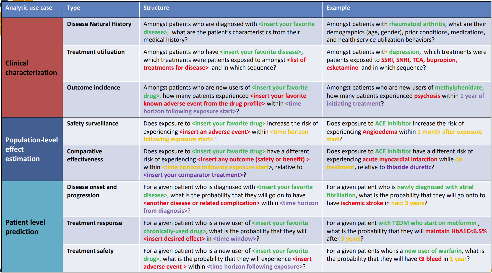

<!DOCTYPE html>
<html>
<body>
<h1>Welcome to my training material test lab!</h1>
<p></p>
</body>
</html>

# Introduction

# Projects Best Suited for Observational Research and OHDSI Network Studies
 

## (This is the exact same table as in the image above only in Markdown)
# Analytic Use Cases and Examples
| Analytic use case | Type | Structure | Example |
| --- | --- | --- | --- |
| **Clinical characterization** | Disease Natural History | Amongst patients who are diagnosed with `<insert your favorite disease>`, what are the patient’s characteristics from their medical history? | Amongst patients with rheumatoid arthritis, what are their demographics (age, gender), prior conditions, medications, and health service utilization behaviors? |
|  | Treatment utilization | Amongst patients who have `<insert your favorite disease>`, which treatments were patients exposed to amongst `<list of treatments for disease>` and in which sequence? | Amongst patients with depression, which treatments were patients exposed to SSRI, SNRI, TCA, bupropion, esketamine and in which sequence? |
|  | Outcome incidence | Amongst patients who are new users of `<insert your favorite drug>`, how many patients experienced `<insert your favorite known adverse event from the drug profile>` within `<time horizon following exposure start>`? | Amongst patients who are new users of methylphenidate, how many patients experienced psychosis within 1 year of initiating treatment? |
| **Population-level effect estimation** | Safety surveillance | Does exposure to `<insert your favorite drug>` increase the risk of experiencing `<insert an adverse event>` within `<time horizon following exposure start>`? | Does exposure to ACE inhibitor increase the risk of experiencing Angioedema within 1 month after exposure start? |
|  | Comparative effectiveness | Does exposure to `<insert your favorite drug>` have a different risk of experiencing `<insert any outcome (safety or benefit)>` within `<time horizon following exposure start>`, relative to `<insert your comparator treatment>`? | Does exposure to ACE inhibitor have a different risk of experiencing acute myocardial infarction while on treatment, relative to thiazide diuretic? |
| **Patient level prediction** | Disease onset and progression | For a given patient who is diagnosed with `<insert your favorite disease>`, what is the probability that they will go on to have `<another disease or related complication>` within `<time horizon from diagnosis>`? | For a given patient who is newly diagnosed with atrial fibrillation, what is the probability that they will go onto to have ischemic stroke in next 3 years? |
|  | Treatment response | For a given patient who is a new user of `<insert your favorite chronically-used drug>`, what is the probability that they will `<insert desired effect>` in `<time window>`? | For a given patient with T2DM who start on metformin, what is the probability that they will maintain HbA1C<6.5% after 3 years? |
|  | Treatment safety | For a given patient who is a new user of `<insert your favorite drug>`, what is the probability that they will experience `<insert adverse event>` within `<time horizon following exposure>`? | For a given patients who is a new user of warfarin, what is the probability that they will have GI bleed in 1 year? |


## The Collaboration Process 
### This is just an example of the kinds of diagrams we can make


# 
## Current CDM


*Source: [OHDSI Common Data Model](https://ohdsi.github.io/CommonDataModel/index.html)*


[Interactive (Select) OMOP Data Dictionary](https://github.com/DBJHU/DBJHU.github.io/blob/main/SelectOMOPDataDictionaryInteractivev2.html)

# Commonly Used CDM Tables Overview
The OMOP common data model (CDM) is a relational database made up of different tables that relate to each other by foreign keys (XXXX_ID values; e.g., PERSON_ID or PROVIDER_ID). The OMOP tables in your data export are as follows:

| Table              | Description |
|--------------------|---------------------|
| Person             | Contains basic demographic information describing a participant, including biological sex, birth date, race, and ethnicity. |
| Visit_occurrence   | Captures encounters with healthcare providers or similar events. Contains the type of visit a person has (outpatient care, inpatient care, or long-term care), as well as the date and duration information. Rows in other tables can reference this table, for example, condition_occurrences related to a specific visit. |
| Condition_occurrence | Indicates the presence of a disease or medical condition stated as a diagnosis, a sign, or symptom, which is either observed by a provider or reported by the patient. |
| Drug_exposure      | Captures records about the utilization of a medication. Drug exposures include prescription and over-the-counter medicines, vaccines, and large-molecule biologic therapies. Radiological devices ingested or applied locally do not count as drugs. Drug exposure is inferred from clinical events associated with orders, prescriptions written, pharmacy dispensing, procedural administrations, and other patient-reported information. |
| Measurement        | Contains both orders and results of a systematic and standardized examination or testing of a participant or participant's sample, including laboratory tests, vital signs, quantitative findings from pathology reports, etc. |
| Procedure_occurrence | Contains records of activities or processes ordered by or carried out by a healthcare provider on the patient to have a diagnostic or therapeutic purpose. |
| Observation        | Captures clinical facts about a person obtained in the context of an examination, questioning, or a procedure. Any data that cannot be represented by another domain, such as social and lifestyle facts, medical history, and family history, are recorded here. |
| Device_exposure    | Captures information about a person's exposure to a foreign physical object or instrument which is used for diagnostic or therapeutic purposes. Devices include implantable objects, blood transfusions, medical equipment and supplies, other instruments used in medical procedures, and material used in clinical care. |
| Death              | Contains the clinical events surrounding how and when a participant dies. |


| Domain                    | Source Vocabulary              | Standard Vocabulary       |
|---------------------------|--------------------------------|---------------------------|
| Conditions                | ICD9, ICD10                    | SNOMED                    |
| Measurements              | LOINC or institutional specific codes | LOINC               |
| Drugs                     | NDC                            | RxNORM                    |
| Procedures                | ICD9, ICD10, CPT               | SNOMED                    |   |

* ICD = International Classification of Diseases
* SNOMED = Systematized Nomenclature of Medicine
* LOINC = Logical Observation Identifiers Names and Codes
* NDC = National Drug Code
* CPT = Current Procedural Terminology

# Analysis Tools
R, SQL, Python, or any preferred data analysis software. Examples provided below are for R and SQL.
[The Book of OHDSI Chapter 9] (https://ohdsi.github.io/TheBookOfOhdsi/SqlAndR.html) provides an overview of analysis of OHDSI data in R and SQL; note that you will not be able to avail yourselves of OHDSI software tools when analyzing your exported data for the reason explained above.
<
## Jupyter Notebooks and programming
[Source:NIH All of US Study] (https://support.researchallofus.org/hc/en-us/articles/360039690191-Jupyter-Notebooks-and-programming)

Below you will find links to  helpful resources on using Jupyter Notebooks. 
Below you will find links to some of the most helpful resources that we have created and/or found on using Jupyter Notebooks. While we can’t teach you how to program, we have identified some online resources that can help get you started.
### OHDSI Resources
Hello! Please familiarize yourself with the following tools and resources which will help you throughout this course and your OHDSI journey.

Check out the [**OHDSI Forums**](https://forums.ohdsi.org/) *Introduce yourself on the "Welcome to OHDSI" thread.*

Bookmark [**The Book of OHDSI**](https://ohdsi.github.io/TheBookOfOhdsi/)

Join the OHDSI [**Microsoft Teams**](https://forms.office.com/Pages/ResponsePage.aspx?id=lAAPoyCRq0q6TOVQkCOy1ZyG6Ud_r2tKuS0HcGnqiQZUQ05MOU9BSzEwOThZVjNQVVFGTDNZRENONiQlQCN0PWcu) environment.

Check out the [**MIMIC-IV demo data set**](https://physionet.org/content/mimic-iv-demo-omop/0.9/1_omop_data_csv/) in OMOP CDM format!

Register with [**EHDEN Academy**](https://academy.ehden.eu/)

Visit the [**Atlas Demo**](https://atlas-demo.ohdsi.org/) and [**Athena**](https://athena.ohdsi.org/search-terms/start).

Bookmark the [**OHDSI YouTube tutorials and workshops**](https://youtube.com/playlist?list=PLpzbqK7kvfeXRQktX0PV-cRpb3EFA2e7Z)

Visit the [**OHDSI Community Dashboard**](https://dash.ohdsi.org/)

Bookmark [**OMOP Common Data Model (ohdsi.github.io)**](https://ohdsi.github.io/CommonDataModel/index.html)

[**Learn about GitHub**](https://docs.github.com/en/get-started/quickstart/hello-world) if you don't already know.

Plan to attend an [**OHDSI Community call**](https://ohdsi.org/community-calls/)

Learn about OHDSI [**Workgroups**](https://ohdsi.org/upcoming-working-group-calls/)

Follow OHDSI on social media: [**Twitter**](https://twitter.com/OHDSI) [**LinkedIn**](https://www.linkedin.com/company/ohdsi)

[**Subscribe**](https://ohdsi.org/subscribe-to-our-newsletter/) to the OHDSI Newsletter

Learn about past and [**upcoming OHDSI events**](https://ohdsi.org/2023-ohdsi-events/)

Learn about OHDSI [**software**](https://ohdsi.org/software-tools/)

Look up individual concepts in [Athena](https://athena.ohdsi.org/)

Check out useful OHDSI-related documentation here: [NIH ALL of US OMOP Documentation](https://support.researchallofus.org/hc/en-us/articles/360039585391-How-the-Observational-Medical-Outcomes-Partnership-OMOP-vocabulary-are-structured)

# Recommended Trainings
## OHDSI Community
  **Broadsea3.0**  
  By: Lee Evans  
 [](https://youtu.be/CNlsZzY7VrM)


## Tufts Bridge2AI Standards Module
- **June 15, 2023:**  
  **Data Quality Dashboard**  
  By: Jared Houghtaling  
  [](https://youtu.be/O2L1x0Sv3lc)

- **July 6, 2023:**  
  **Data Quality Dashboard output demo**  
  By: Jared Houghtaling  
  [](https://youtu.be/qYDq5-dg-io)

- **July 13, 2023:**  
  **Achilles output demo**  
  By: Jared Houghtaling  
  [](https://youtu.be/bIRQVgcnAwI)

- **July 27, 2023:**  
  **Flowsheet follow-up**  
  By: Polina Talapova & Jared Houghtaling  
  [](https://youtu.be/3cTT2XJZslI)

- **August 3, 2023:**  
  **OMOP Standardized Vocabularies - Part 1**  
  By: Jared Houghtaling and Polina Talapova  
  [](https://youtu.be/4xnH7-oJxyo)

- **August 17, 2023:**  
  **OMOP Standardized Vocabularies - Part 2**  
  By: Polina Talapova  
  [](https://youtu.be/1J7ISUASx6k)

- **August 24, 2023:**  
  **How to download and set-up a DDL (Demo)**  
  By: Jared Houghtaling  
  [](https://youtu.be/x9W3sa1xGoQ)

- **August 31, 2023:**  
  **Demo of WhiteRabbit and RabbitInAHat**  
  By: Jared Houghtaling  
  [](https://youtu.be/gu1fQVwkBo8)

- **September 7, 2023:**  
  **ARES usefulness for ETL at Tufts**  
  By: Jared Houghtaling  
  [](https://youtu.be/Czox3WT1pDM)

- **September 14, 2023:**  
  **Google form introduction for site progress tracking**  
  By: Jared Houghtaling  
  [](https://youtu.be/ntZwikqhIcM)

- **September 21, 2023:**  
  **Sample ETL Process**  
  By: Jared Houghtaling  
  [](https://youtu.be/uX289BrzXM4)

**October 12, 2023:**  
  **Google Form for Site Progress Tracking**  
  With Jared Houghtaling and Andrew Williams  
  [](https://youtu.be/oTP6ISo8FWc)

- **October 26, 2023:**  
  **Review and Prioritization of DQD Results, and Discussion of DQD Issue Severity**  
  With Jared Houghtaling  
  [](https://youtu.be/dJr5tkm-Ex4)

- **November 2, 2023:**  
  **Principles of Mapping and Vocab Gaps Identification**  
  With Polina Talapova  
  [](https://youtu.be/jOKzb3x6hmo)

- **November 9, 2023:**  
  **Usagi & STCM Demo**  
  With Polina Talapova & Jared Houghtailing  
  [](https://youtu.be/hNhph-elrp4)


## Python, SQL, and R Programming Resources

- [Project Jupyter](https://jupyter.org/)
- [What is the Jupyter Notebook?](https://jupyter-notebook-beginner-guide.readthedocs.io/en/latest/what_is_jupyter.html)
- [NIAID NIH Informatics resources](https://bioinformatics.niaid.nih.gov/resources)

Software Carpentry is a website that provides free online lessons to researchers wanting to enhance their programming skills for data analysis. This website offers free online lessons on a variety of useful topics including:

- [Programming with Python](http://swcarpentry.github.io/python-novice-inflammation/)
- [Programming with R](http://swcarpentry.github.io/r-novice-inflammation/)
- [Databases and SQL](http://swcarpentry.github.io/sql-novice-survey/)

We have included additional resources for help with programming below.

- [DataCamp](http://www.datacamp.com/)
- [Khan Academy](https://www.khanacademy.org/computing/computer-programming/sql/sql-basics/v/welcome-to-sql)
- [Codecademy - Learn Python 2](https://www.codecademy.com/learn/learn-python)
- [Python Data Science Handbook](https://jakevdp.github.io/PythonDataScienceHandbook/)
- [R for Data Science](https://r4ds.had.co.nz/)
- [Introduction to Programming (NIAID, NIH)](https://bioinformatics.niaid.nih.gov/resources - 70.3.1)
- [Python Programming (NIAID, NIH)](https://bioinformatics.niaid.nih.gov/resources - 70.3.2)
- [Data Analysis with Python and Pandas (NIAID, NIH)](https://bioinformatics.niaid.nih.gov/resources - 70.3.3)
- [Data Visualization with Python (NIAID, NIH)](https://bioinformatics.niaid.nih.gov/resources - 70.3.4)


## Analysis with SQL

The [OMOP Query Library](https://data.ohdsi.org/QueryLibrary/) is a library of commonly-used SQL queries for the OMOP Common Data Model (CDM).


## Analysis with R
Below are some sample R queries that demonstrate how to read in OMOP tables from CSV files, join them based on the `person_id` and `visit_occurrence_id` fields, and search for specific criteria.

Note: Adjust the file paths and column names accordingly based on the actual structure and location of your CSV files. The queries below are a generic representation and may need adjustments based on the specifics of your data set.

### Reading CSV files into R data frames:

```R
# Read the CSV files into R data frames
person_df <- read.csv("path_to_person_table.csv", header=TRUE, stringsAsFactors=FALSE)
visit_occurrence_df <- read.csv("path_to_visit_occurrence_table.csv", header=TRUE, stringsAsFactors=FALSE)
condition_occurrence_df <- read.csv("path_to_condition_occurrence_table.csv", header=TRUE, stringsAsFactors=FALSE)
```
Join tables based on `person_id`:

When a person has multiple visits in the `visit_occurrence` table, joining the `person` table with the `visit_occurrence` table will result in multiple rows for that person, each corresponding to a different visit. This is a standard one-to-many join operation.

```R
## Join person with visit_occurrence on 'person_id'
person_visit_df <- merge(person_df, visit_occurrence_df, by="person_id")
```

### Joining the Person-Visit table with the Condition Occurrence table:

```R
# Join the person-visit result with condition_occurrence on both 'person_id' and 'visit_occurrence_id'
full_df <- merge(person_visit_df, condition_occurrence_df, by=c("person_id", "visit_occurrence_id"))
```

### Search by a list of `person_ids`:

```R
# Define a list of person_ids to search for
search_person_ids <- c(1, 2, 3, 4, 5)

# Filter the data frame to only include rows with person_ids in the list
filtered_by_person_df <- subset(full_df, person_id %in% search_person_ids)
```

### Search by a specific condition concept code:

```R
# Define a specific condition concept code to search for
search_condition_concept_id <- 1234567

# Filter the data frame to only include rows with the specified condition concept code
filtered_by_condition_df <- subset(full_df, condition_concept_id == search_condition_concept_id)
```

### Search by a date range:

```R
# Define a date range to search for
start_date <- as.Date("2020-01-01")
end_date <- as.Date("2020-12-31")

## Filter the data frame to only include rows within the date range
filtered_by_date_df <- subset(full_df, visit_start_date >= start_date & visit_start_date <= end_date)
```
<!--TBD
## Analysis with Python 

### Required Python Libraries:

To execute the Python queries, you'll need to install the pandas library. -->


<!--- WIP 

# OMOP ETL Process: Common Problems and Solutions

## Design and Planning
| Problem | Suggestion |
| ------- | ---------- |
| Different Coding Schemes in Databases | Standardize structures, conventions, and content during ETL to align different coding schemes. |
| Designing ETL with Expert Collaboration | Collaborate between data and CDM experts for efficient design. |
| Inadequate Source Data Documentation | Use White Rabbit to scan and understand source data thoroughly. |
| Mapping Source Data to CDM | Use Rabbit-in-a-Hat tool for interactive mapping and documentation. |
| Mapping Non-OMOP Coding Systems | Focus on frequently used codes and utilize existing mappings where possible. |
| Handling Post Coordinated SNOMED Codes | Address challenges with codes or conditions occurring multiple times. |
| Integration of New Data Sources | Develop a flexible ETL process to integrate new data sources. |
| Handling Various Data Formats | Create processes to handle different data formats effectively. |
| Custom Code Development for ETL | Develop custom code when necessary for specific ETL requirements. |
| Adapting to CDM Updates | Adapt ETL processes to accommodate updates in the CDM. |

## Implementation and Technology
| Problem | Suggestion |
| ------- | ---------- |
| ETL Implementation | Utilize existing code and community resources for efficient ETL process implementation. |
| Choosing ETL Implementation Technology | Select technology based on site expertise (SQL, SAS, C#, Java, etc.). |
| Data Transformation Logic | Clearly define and document the logic for data transformations. |
| ETL Performance Optimization | Continuously monitor and optimize ETL performance. |
| Scalability of ETL Processes | Ensure that ETL processes are scalable to accommodate growing data. |
| Data Mapping Complexities | Address complexities in mapping data from various sources to the CDM. |
| Updating and Maintenance of ETL Scripts | Regularly update and maintain ETL scripts for consistency. |
| Managing ETL Dependencies | Identify and manage dependencies in the ETL process. |
| Cross-Database Compatibility | Ensure compatibility of ETL processes across different databases. |
| Optimizing Data Load Processes | Optimize data load processes to enhance performance. |

## Data Quality and Security
| Problem | Suggestion |
| ------- | ---------- |
| Data Quality Issues | Implement thorough quality control measures to ensure data integrity. |
| Large Dataset Handling | Optimize ETL processes for handling large datasets efficiently. |
| Missing or Incomplete Data | Develop strategies to handle missing or incomplete data elements. |
| Handling Data Anomalies | Develop procedures to identify and resolve data anomalies. |
| Data Security and Compliance | Maintain strict adherence to data security and compliance standards. |
| Data Validation Processes | Implement robust data validation processes to ensure accuracy. |
| Error Handling in ETL Process | Develop comprehensive error handling mechanisms. |
| Source Data Version Control | Maintain version control for source data to track changes. |
| Data Cleansing Procedures | Establish data cleansing procedures to improve data quality. |
| Complex Transformation Rules | Manage complex transformation rules efficiently. |

## Operational Management
| Problem | Suggestion |
| ------- | ---------- |
| Automation of ETL Processes | Explore opportunities to automate repetitive ETL tasks. |
| Resource Allocation for ETL Tasks | Allocate sufficient resources for ETL tasks. |
| Maintaining Data Lineage | Keep track of data lineage throughout the ETL process. |
| Balancing ETL Speed and Accuracy | Balance the need for speed with accuracy in ETL processes. |
| Training for ETL Team | Provide comprehensive training for the ETL team. |
| Standardizing ETL Practices | Standardize ETL practices across various projects. |
| Monitoring ETL Processes | Implement monitoring tools to oversee ETL processes. |
| Dealing with Data Duplication | Develop strategies to handle data duplication issues. |
| Dynamic Data Source Integration | Integrate dynamic data sources effectively into the ETL process. |
| Data Transformation Standardization | Standardize data transformation rules across different datasets. |
| Collaboration and Communication | Foster collaboration and communication among all stakeholders involved in the ETL process. | 
-->


```python
from google.colab import output
output.enable_custom_widget_manager()
```


```python
from google.colab import output
output.enable_custom_widget_manager()
```


```python
!pip install qgrid
```


```python
!pip install itables

```

```python
import pandas as pd
from itables import init_notebook_mode, show

init_notebook_mode(all_interactive=True)


```


```python
import pandas as pd
import qgrid

# Load data
df = pd.read_csv('/content/BasicOMOPdd.csv')

# Set the grid options
grid_options = {
    'enableColumnReorder': True,
    'enableTextSelectionOnCells': True,
    'editable': False,  # Set to True if you want to allow editing
    'sortable': True,
    'filterable': True,
    'autoResizeColumns': True,
    'multiColumnSort': True
}

# Show the grid
grid = qgrid.show_grid(df, show_toolbar=True, grid_options=grid_options)
grid

```


    QgridWidget(grid_options={'fullWidthRows': True, 'syncColumnCellResize': True, 'forceFitColumns': True, 'defau…


```python
show(df)

```


<style>.itables table td {
    text-overflow: ellipsis;
    overflow: hidden;
}

.itables table th {
    text-overflow: ellipsis;
    overflow: hidden;
}

.itables thead input {
    width: 100%;
    padding: 3px;
    box-sizing: border-box;
}

.itables tfoot input {
    width: 100%;
    padding: 3px;
    box-sizing: border-box;
}
</style>
<div class="itables">
<table id="db334aff-3fcc-4ec8-9d8f-1a96a4e8e9ba" class="display nowrap"style="table-layout:auto;width:auto;margin:auto;caption-side:bottom"><thead>
    <tr style="text-align: right;">

      <th>Relevant OMOP Table</th>
      <th>Field Name</th>
      <th>Description</th>
    </tr>
  </thead><tbody><tr><td>Loading... (need <a href=https://mwouts.github.io/itables/troubleshooting.html>help</a>?)</td></tr></tbody></table>
<link rel="stylesheet" type="text/css" href="https://cdn.datatables.net/1.13.1/css/jquery.dataTables.min.css">
<script type="module">
    // Import jquery and DataTable
    import 'https://code.jquery.com/jquery-3.6.0.min.js';
    import dt from 'https://cdn.datatables.net/1.12.1/js/jquery.dataTables.mjs';
    dt($);

    // Define the table data
    const data = [["person", "person_id", "A unique identifier for each person. "], ["person", "gender_concept_id", "A foreign key that refers to an identifier in the CONCEPT table for self-reported genderor sex at birth for the participant."], ["person", "year_of_birth", "The year of birth of the person. For data sources with date of birth, the year is extracted. For data sources where the year of birth is not available, the approximate year of birth is derived based on any age group categorization available."], ["person", "month_of_birth", "The month of birth of the person. For data sources that provide the precise date of birth, the month is extracted and stored in this field."], ["person", "day_of_birth", "The day of the month of birth of the person. For data sources that provide the precise date of birth, the day is extracted and stored in this field."], ["person", "birth_datetime", "The date and time of birth of the person. "], ["person", "race_concept_id", "A foreign key that refers to an identifier in the CONCEPT table for the unique race of the person, belonging to the 'Race' vocabulary."], ["person", "ethnicity_concept_id", "A foreign key that refers to the standard concept identifier in the Standardized Vocabularies for the ethnicity of the person, belonging to the 'Ethnicity' vocabulary."], ["person", "location_id", "A foreign key to the place of residency for the person in the location table, where the detailed address information is stored."], ["person", "provider_id", "A foreign key to the primary care provider the person is seeing in the PROVIDER table."], ["person", "care_site_id", "A foreign key to the site of primary care in the care_site table, where the details of the care site are stored."], ["person", "person_source_value", "An (encrypted) key derived from the person identifier in the source data. This is necessary when a use case requires a link back to the person data at the source dataset."], ["person", "gender_source_value", "The source code for the self-reported gender or sex at birth for the participant as it appears in the source data. The person\u2019s response is mapped to a standardconcept in the Standardized Vocabularies; the original value is stored here for reference."], ["person", "gender_source_concept_id", "A foreign key to the self-reported gender or sex at birth  concept for the participant that refers to the code used in the source."], ["person", "race_source_value", "The source code for the race of the person as it appears in the source data. The person race is mapped to a standard race concept in the Standardized Vocabularies and the original value is stored here for reference."], ["person", "race_source_concept_id", "A foreign key to the race concept that refers to the code used in the source."], ["person", "ethnicity_source_value", "The source code for the ethnicity of the person as it appears in the source data. The person ethnicity is mapped to a standard ethnicity concept in the Standardized Vocabularies and the original code is, stored here for reference."], ["person", "ethnicity_source_concept_id", "A foreign key to the ethnicity concept that refers to the code used in the source."], ["condition_occurrence", "condition_occurrence_id", "A unique identifier for each Condition Occurrence event."], ["condition_occurrence", "person_id", "A foreign key identifier to the Person for whom the condition is recorded. The demographic details of that Person are stored in the PERSON table."], ["condition_occurrence", "condition_concept_id", "A foreign key that refers to a Standard Concept identifier in the Standardized Vocabularies belonging to the 'Condition' domain."], ["condition_occurrence", "condition_start_date", "The date when the instance of the Condition is recorded. "], ["condition_occurrence", "condition_start_datetime", "The date and time when the instance of the Condition is recorded. "], ["condition_occurrence", "condition_end_date", "The date when the instance of the Condition is considered to have ended."], ["condition_occurrence", "condition_end_datetime", "The date and time when the instance of the Condition is considered to have ended. "], ["condition_occurrence", "condition_type_concept_id", "A foreign key to the predefined Concept identifier in the Standardized Vocabularies reflecting the source data from which the Condition was recorded, the level of standardization, and the type of occurrence. "], ["condition_occurrence", "stop_reason", "The reason that the Condition was no longer present, as indicated in the source data."], ["condition_occurrence", "provider_id", "A foreign key to the Provider in the PROVIDER table who was responsible for capturing (diagnosing) the Condition."], ["condition_occurrence", "visit_occurrence_id", "A foreign key to the unique identifier for the visit in the VISIT_OCCURRENCE table during which the Condition was determined (diagnosed)."], ["condition_occurrence", "condition_source_value", "The source code for the Condition as it appears in the source data. This code is mapped to a Standard Condition Concept in the Standardized Vocabularies and the original code is stored here for reference."], ["condition_occurrence", "condition_source_concept_id", "A foreign key to a Condition Concept that refers to the code used in the source."], ["condition_occurrence", "condition_status_source_value", "The source code for the condition status as it appears in the source data. This code is mapped to a Standard Concept in the Standardized Vocabularies and the original code is stored here for reference."], ["condition_occurrence", "condition_status_concept_id", "The source code for the condition status as it appears in the source data."], ["visit_occurrence", "visit_occurrence_id", "A unique identifier for each Person's visit or encounter at a healthcare provider."], ["visit_occurrence", "person_id", "A foreign key identifier to the Person for whom the visit is recorded. The demographic details of that Person are stored in the PERSON table."], ["visit_occurrence", "visit_concept_id", "A foreign key that refers to a visit Concept identifier in the Standardized Vocabularies belonging to the 'Visit' Vocabulary."], ["visit_occurrence", "visit_start_date", "The start date of the visit."], ["visit_occurrence", "visit_start_datetime", "The date and time of the visit started."], ["visit_occurrence", "visit_end_date", "The end date of the visit. If this is a one-day visit the end date should match the start date."], ["visit_occurrence", "visit_end_datetime", " The date and time of the visit end."], ["visit_occurrence", "visit_type_concept_id", "A foreign key to the predefined Concept identifier in the Standardized Vocabularies reflecting the type of source data from which the visit record is derived."], ["visit_occurrence", "provider_id", "A foreign key to the provider in the PROVIDER table who was associated with the visit."], ["visit_occurrence", "care_site_id", "A foreign key to the care site in the care site table that was visited"], ["visit_occurrence", "visit_source_value", "The source code for the visit as it appears in the source data."], ["visit_occurrence", "visit_source_concept_id", "A foreign key to a Concept that refers to the code used in the source."], ["visit_occurrence", "admitting_source_concept_id", "A foreign key to the predefined concept in the Place of Service Vocabulary reflecting the admitting source for a visit."], ["visit_occurrence", "admitting_source_value", "The source code for the admitting source as it appears in the source data."], ["visit_occurrence", "discharge_to_concept_id", "A foreign key to the predefined concept in the Place of Service Vocabulary reflecting the discharge disposition for a visit."], ["visit_occurrence", "discharge_to_source_value", "The source code for the discharge disposition as it appears in the source data."], ["visit_occurrence", "preceding_visit_occurrence_id", "A foreign key to the visit_occurrence table of the visit immediately preceding this visit."], ["visit_detail", "visit_detail_id", "A unique identifier for each Person's unique interaction with the health care system."], ["visit_detail", "person_id", "A foreign key identifier to the Person for whom the visit is recorded. The demographic details of that Person are stored in the PERSON table."], ["visit_detail", "visit_detail_concept_id", "A foreign key that refers to a visit Concept identifier in the Standardized Vocabularies belonging to the 'Visit' Vocabulary."], ["visit_detail", "visit_detail_start_date", "The start date of the encounter."], ["visit_detail", "visit_detail_start_datetime", "The date and time of the encounter started."], ["visit_detail", "visit_detail_end_date", "The end date of the encounter."], ["visit_detail", "visit_detail_end_datetime", "The date and time of the encounter ended. "], ["visit_detail", "visit_detail_type_concept_id", "A foreign key to the predefined Concept identifier in the Standardized Vocabularies reflecting the type of source data from which the visit record is derived."], ["visit_detail", "provider_id", "A foreign key to the provider in the PROVIDER table who was associated with the visit."], ["visit_detail", "care_site_id", "A foreign key to the care site in the care site table that was visited"], ["visit_detail", "visit_detail_source_value", "The source code for the visit as it appears in the source data."], ["visit_detail", "visit_detail_source_concept_id", "A foreign key to a Concept that refers to the code used in the source."], ["visit_detail", "admitting_source_value", "The source code for the admitting source as it appears in the source data."], ["visit_detail", "admitting_source_concept_id", "A foreign key to the predefined concept in the Place of Service Vocabulary reflecting the admitting source for a visit."], ["visit_detail", "discharge_to_source_value", "The source code for the discharge disposition as it appears in the source data."], ["visit_detail", "discharge_to_concept_id", "A foreign key to the predefined concept in the Place of Service Vocabulary reflecting the discharge disposition for a visit."], ["visit_detail", "preceding_visit_detail_id", "A foreign key to the visit_occurrence table of the visit immediately preceding this visit."], ["visit_detail", "visit_detail_parent_id", "Use this field to find the visit detail that subsumes the given visit detail record. This is used in the case that a visit detail record needs to be nested beyond the VISIT_OCCURRENCE/VISIT_DETAIL relationship."], ["visit_detail", "visit_occurrence_id", "A foreign key to the unique identifier for the visit in the VISIT_OCCURRENCE table during which the encounter occurred."], ["drug_exposure", "drug_exposure_id", "A system-generated unique identifier for each Drug utilization event."], ["drug_exposure", "person_id", "A foreign key identifier to the Person who is subjected to the Drug. The demographic details of that Person are stored in the PERSON table."], ["drug_exposure", "drug_concept_id", "A foreign key that refers to a Standard Concept identifier in the Standardized Vocabularies belonging to the 'Drug' domain."], ["drug_exposure", "drug_exposure_start_date", "The start date for the current instance of Drug utilization. Valid entries include a start date of a prescription, the date a prescription was filled, or the date on which a Drug administration procedure was recorded."], ["drug_exposure", "drug_exposure_start_datetime", "The start date and time for the current instance of Drug utilization. Valid entries include a start datetime of a prescription, the date and time a prescription was filled, or the date and time on which a Drug administration procedure was recorded."], ["drug_exposure", "drug_exposure_end_date", "The end date for the current instance of Drug utilization. Depending on different sources, it could be a known or an inferred date and denotes the last day at which the patient was still exposed to Drug."], ["drug_exposure", "drug_exposure_end_datetime", "The end date and time for the current instance of Drug utilization. Depending on different sources, it could be a known or an inferred date and time and denotes the last day at which the patient was still exposed to Drug."], ["drug_exposure", "verbatim_end_date", "The known end date of a Drug Exposure as provided by the source."], ["drug_exposure", "drug_type_concept_id", "A foreign key to the predefined Concept identifier in the Standardized Vocabularies reflecting the type of Drug Exposure recorded. It indicates how the Drug Exposure was represented in the source data."], ["drug_exposure", "stop_reason", "The reason the Drug was stopped. "], ["drug_exposure", "refills", "The number of refills after the initial prescription. The initial prescription is not counted, values start with null."], ["drug_exposure", "quantity", "The quantity of drug as recorded in the original prescription or dispensing record."], ["drug_exposure", "days_supply", "The number of days of supply of the medication as prescribed. This reflects the intention of the provider for the length of exposure."], ["drug_exposure", "sig", "The directions ('signetur') on the Drug prescription as recorded in the original prescription (and printed on the container) or dispensing record."], ["drug_exposure", "route_concept_id", "A foreign key that refers to a Standard Concept identifier in the Standardized Vocabularies reflecting the route of administration and belonging to the 'Route' domain."], ["drug_exposure", "lot_number", "An identifier assigned to a particular quantity or lot of Drug product from the manufacturer."], ["drug_exposure", "provider_id", "A foreign key to the provider in the PROVIDER table who initiated (prescribed or administered) the Drug Exposure."], ["drug_exposure", "visit_occurrence_id", "A foreign key to the Visit in the VISIT_OCCURRENCE table during which the Drug Exposure was initiated."], ["drug_exposure", "visit_detail_id", "A foreign key to the Visit Detail in the VISIT_DETAIL table during which the Drug Exposure was initiated."], ["drug_exposure", "drug_source_value", "The source code for the Drug as it appears in the source data. This code is mapped to a Standard Drug concept in the Standardized Vocabularies and the original code is, stored here for reference."], ["drug_exposure", "drug_source_concept_id", "A foreign key to a Drug Concept that refers to the code used in the source."], ["drug_exposure", "route_source_value", "The information about the route of administration as detailed in the source."], ["drug_exposure", "dose_unit_source_value", "The information about the dose unit as detailed in the source."], ["measurement", "measurement_id", "A unique identifier for each Measurement."], ["measurement", "person_id", "A foreign key identifier to the Person about whom the measurement was recorded. The demographic details of that Person are stored in the PERSON table."], ["measurement", "measurement_concept_id", "A foreign key to the standard measurement concept identifier in the Standardized Vocabularies. These belong to the 'Measurement' domain, but could overlap with the 'Observation' domain."], ["measurement", "measurement_date", "The date of the Measurement."], ["measurement", "measurement_datetime", "The date and time of the Measurement. Some database systems don't have a datatype of time. To accommodate all temporal analyses, datatype datetime can be used (combining measurement_date and measurement_time forum discussion)"], ["measurement", "measurement_type_concept_id", "A foreign key to the predefined Concept in the Standardized Vocabularies reflecting the provenance from where the Measurement record was recorded. "], ["measurement", "operator_concept_id", "A foreign key identifier to the predefined Concept in the Standardized Vocabularies reflecting the mathematical operator that is applied to the value_as_number. "], ["measurement", "value_as_number", "A Measurement result where the result is expressed as a numeric value."], ["measurement", "value_as_concept_id", "A foreign key to a Measurement result represented as a Concept from the Standardized Vocabularies (e.g., positive/negative, present/absent, low/high, etc.). These belong to the 'Meas Value' domain. "], ["measurement", "unit_concept_id", "A foreign key to a Standard Concept ID of Measurement Units in the Standardized Vocabularies that belong to the 'Unit' domain."], ["measurement", "range_low", "The lower limit of the normal range of the Measurement result. The lower range is assumed to be of the same unit of measure as the Measurement value."], ["measurement", "range_high", "The upper limit of the normal range of the Measurement. The upper range is assumed to be of the same unit of measure as the Measurement value."], ["measurement", "provider_id", "A foreign key to the provider in the PROVIDER table who was responsible for initiating or obtaining the measurement."], ["measurement", "visit_occurrence_id", "A foreign key to the Visit in the VISIT_OCCURRENCE table during which the Measurement was recorded."], ["measurement", "visit_detail_id", "A foreign key to the Visit Detail in the VISIT_DETAIL table during which the Measurement was taken."], ["measurement", "measurement_source_value", "The Measurement name as it appears in the source data. This code is mapped to a Standard Concept in the Standardized Vocabularies and the original code is stored here for reference."], ["measurement", "measurement_source_concept_id", "A foreign key to a Concept in the Standard Vocabularies that refers to the code used in the source."], ["measurement", "unit_source_value", "The source code for the unit as it appears in the source data. This code is mapped to a standard unit concept in the Standardized Vocabularies and the original code is stored here for reference."], ["measurement", "value_source_value", "The source value associated with the content of the value_as_number or value_as_concept_id as stored in the source data."], ["procedure_occurrence", "procedure_occurrence_id", "A system-generated unique identifier for each Procedure Occurrence."], ["procedure_occurrence", "person_id", "A foreign key identifier to the Person who is subjected to the Procedure. The demographic details of that Person are stored in the PERSON table."], ["procedure_occurrence", "procedure_concept_id", "A foreign key that refers to a standard procedure Concept identifier in the Standardized Vocabularies. These belong to the 'Procedure' domain."], ["procedure_occurrence", "procedure_date", "The date on which the Procedure was performed."], ["procedure_occurrence", "procedure_datetime", "The date and time on which the Procedure was performed."], ["procedure_occurrence", "procedure_type_concept_id", "A foreign key to the predefined Concept identifier in the Standardized Vocabularies reflecting the type of source data from which the procedure record is derived."], ["procedure_occurrence", "modifier_concept_id", "A foreign key to a Standard Concept identifier for a modifier to the Procedure (e.g. bilateral). "], ["procedure_occurrence", "quantity", "The quantity of procedures ordered or administered."], ["procedure_occurrence", "provider_id", "A foreign key to the provider in the PROVIDER table who was responsible for carrying out the procedure."], ["procedure_occurrence", "visit_occurrence_id", "A foreign key to the Visit in the VISIT_OCCURRENCE table during which the Procedure was carried out."], ["procedure_occurrence", "procedure_source_value", "The source code for the Procedure as it appears in the source data. This code is mapped to a standard procedure Concept in the Standardized Vocabularies and the original code is, stored here for reference. "], ["procedure_occurrence", "procedure_source_concept_id", "A foreign key to a Procedure Concept that refers to the code used in the source."], ["procedure_occurrence", "qualifier_source_value", "The source value for the qualifier as it appears in the source data."], ["observation", "observation_id", "A unique identifier for each observation."], ["observation", "person_id", "A foreign key identifier to the Person about whom the observation was recorded. The demographic details of that Person are stored in the PERSON table."], ["observation", "observation_concept_id", "A foreign key to the standard observation concept identifier in the Standardized Vocabularies. In cases where the recorded observation is the answer to a PPI question, this field will contain the Standard Concept ID for the corresponding question (or, if the question is non-standard, its standard LOINC/SNOMED equivalent)."], ["observation", "observation_date", "The date of the observation."], ["observation", "observation_datetime", "The date and time of the observation."], ["observation", "observation_type_concept_id", "A foreign key to the predefined concept identifier in the Standardized Vocabularies reflecting the type of the observation belonging to the 'Observation' domain."], ["observation", "value_as_number", "The observation result stored as a number. This is applicable to observations where the result is expressed as a numeric value."], ["observation", "value_as_string", "The observation result stored as a string. This is applicable to observations where the result is expressed as verbatim text."], ["observation", "value_as_concept_id", "A foreign key to an observation result stored as a Concept ID. This is applicable to observations where the result can be expressed as a Standard Concept from the Standardized Vocabularies (e.g., positive/negative, present/absent, low/high, etc.). These belong to the 'Meas Value' domain. In cases where the recorded observation is the answer to a PPI question, this field will contain the standard PPI answer Concept ID or its standard LOINC/SNOMED equivalent (if the answer is non-standard). For PPI, this field is derived from value_source_concept_id."], ["observation", "value_source_value", "The source value associated with the content of the value_as_number or value_as_concept_id as stored in the source data."], ["observation", "qualifier_concept_id", "A foreign key to a Standard Concept ID for a qualifier (e.g., severity of drug-drug interaction alert)"], ["observation", "unit_concept_id", "A foreign key to a Standard Concept ID of measurement units in the Standardized Vocabularies belonging to the 'Unit' domain."], ["observation", "provider_id", "A foreign key to the provider in the PROVIDER table who was responsible for making the observation."], ["observation", "visit_occurrence_id", "A foreign key to the visit in the VISIT_OCCURRENCE table during which the observation was recorded."], ["observation", "visit_detail_id", "A foreign key to the Visit Detail in the VISIT_DETAIL table during which the Observation was recorded."], ["observation", "observation_source_value", "The observation code as it appears in the source data. This code is mapped to a Standard Concept in the Standardized Vocabularies and the original code is, stored here for reference. If the recorded observation is the answer to a PPI question, the code for the PPI question is stored here. "], ["observation", "observation_source_concept_id", "A foreign key to a Concept that refers to the code used in the source. If the recorded observation is the answer to a PPI question, the PPI concept for the question is stored here."], ["observation", "value_source_concept_id", "A foreign key to an Observation result represented as a Concept from the Standardized Vocabularies (e.g., positive/negative, present/absent, low/high, etc.).  For EHR data, these will be from the \"Meas Val\" domain. \\n\\nIf the recorded observation is the response to a PPI question, this field will contain the PPI concept for the answer."], ["observation", "unit_source_value", "The source code for the unit as it appears in the source data. This code is mapped to a standard unit concept in the Standardized Vocabularies and the original code is, stored here for reference."], ["observation", "qualifier_source_value", "The source value associated with a qualifier to characterize the observation"], ["observation_period", "observation_period_id", "A unique identifier for each observation period"], ["observation_period", "person_id", "A foreign key identifier to the person for whom the observation period is defined. The demographic details of that person are stored in the PERSON table"], ["observation_period", "observation_period_start_date", "The start date of the observation period for which data are available from the data source"], ["observation_period", "observation_period_end_date", "The end date of the observation period for which data are available from the data source"], ["observation_period", "period_type_concept_id", "A foreign key identifier to the predefined concept in the Standardized Vocabularies reflecting the source of the observation period information, belonging to the 'Obs Period Type' vocabulary"], ["device_exposure", "device_exposure_id", "A system-generated unique identifier for each Device Exposure."], ["device_exposure", "person_id", "A foreign key identifier to the Person who is subjected to the Device. The demographic details of that Person are stored in the PERSON table."], ["device_exposure", "device_concept_id", "A foreign key that refers to a Standard Concept identifier in the Standardized Vocabularies belonging to the 'Device' domain."], ["device_exposure", "device_exposure_start_date", "The date the Device or supply was applied or used."], ["device_exposure", "device_exposure_start_datetime", "The date and time the Device or supply was applied or used."], ["device_exposure", "device_exposure_end_date", "The date use of the Device or supply was ceased."], ["device_exposure", "device_exposure_end_datetime", "The date and time use of the Device or supply was ceased."], ["device_exposure", "device_type_concept_id", "A foreign key to the predefined Concept identifier in the Standardized Vocabularies reflecting the type of Device Exposure recorded. It indicates how the Device Exposure was represented in the source data and belongs to the 'Device Type' domain."], ["device_exposure", "unique_device_id", "A UDI or equivalent identifying the instance of the Device used in the Person."], ["device_exposure", "quantity", "The number of individual Devices used in the exposure."], ["device_exposure", "provider_id", "A foreign key to the provider in the PROVIDER table who initiated or administered the Device."], ["device_exposure", "visit_occurrence_id", "A foreign key to the visit in the VISIT_OCCURRENCE table during which the Device was used."], ["device_exposure", "visit_detail_id", "A foreign key to the Visit Detail in the VISIT_DETAIL table during which the Device Exposure was initiated."], ["device_exposure", "device_source_value", "The source code for the Device as it appears in the source data. This code is mapped to a Standard Device Concept in the Standardized Vocabularies and the original code is stored here for reference."], ["device_exposure", "device_source_concept_id", "A foreign key to a Device Concept that refers to the code used in the source."], ["death", "person_id", "A foreign key identifier to the deceased person. The demographic details of that person are stored in the PERSON table."], ["death", "death_date   ", "The date the person was deceased. If the precise date including day or month is not known or not allowed, December is used as the default month, and the last day of the month the default day."], ["death", "death_datetime", "The date and time the person was deceased. If the precise date including day or month is not known or not allowed, December is used as the default month, and the last day of the month the default day."], ["death", "death_type_concept_id", "A foreign key referring to the predefined concept identifier in the Standardized Vocabularies reflecting how the death was represented in the source data."], ["death", "cause_concept_id", "A foreign key referring to a standard concept identifier in the Standardized Vocabularies for conditions."], ["death", "cause_source_value", "The source code for the cause of death as it appears in the source data. This code is mapped to a standard concept in the Standardized Vocabularies and the original code is, stored here for reference."], ["death", "cause_source_concept_id", "A foreign key to the concept that refers to the code used in the source. Note, this variable name is abbreviated to ensure it will be allowable across database platforms."], ["fact_relationship", "domain_concept_id_1", "The concept representing the domain of fact one, from which the corresponding table can be inferred."], ["fact_relationship", "fact_id_1", "The unique identifier in the table corresponding to the domain of fact one."], ["fact_relationship", "domain_concept_id_2", "The concept representing the domain of fact two, from which the corresponding table can be inferred."], ["fact_relationship", "fact_id_2", "The unique identifier in the table corresponding to the domain of fact two."], ["fact_relationship", "relationship_concept_id", "A foreign key to a Standard Concept ID of relationship in the Standardized Vocabularies belonging to the 'Relationship' domain."], ["specimen", "specimen_id", "A unique identifier for each specimen."], ["specimen", "person_id", "A foreign key identifier to the Person for whom the Specimen is recorded."], ["specimen", "specimen_concept_id", "A foreign key referring to a Standard Concept identifier in the Standardized Vocabularies for the Specimen belonging to the 'Specimen' domain."], ["specimen", "specimen_type_concept_id", "A foreign key referring to the Concept identifier in the Standardized Vocabularies reflecting the system of record from which the Specimen was represented in the source data."], ["specimen", "specimen_date", "The date the specimen was obtained from the Person."], ["specimen", "specimen_datetime", "The date and time on the date when the Specimen was obtained from the person."], ["specimen", "quantity", "The amount of specimen collection from the person during the sampling procedure."], ["specimen", "unit_concept_id", "A foreign key to a Standard Concept identifier for the Unit associated with the numeric quantity of the Specimen collection belonging to the 'Unit' domain/"], ["specimen", "anatomic_site_concept_id", "A foreign key to a Standard Concept identifier for the anatomic location of specimen collection."], ["specimen", "disease_status_concept_id", "A foreign key to a Standard Concept identifier for the Disease Status of specimen collection."], ["specimen", "specimen_source_id", "The Specimen identifier as it appears in the source data."], ["specimen", "specimen_source_value", "The Specimen value as it appears in the source data. This value is mapped to a Standard Concept in the Standardized Vocabularies and the original code is, stored here for reference."], ["specimen", "unit_source_value", "The information about the Unit as detailed in the source."], ["specimen", "anatomic_site_source_value", "The information about the anatomic site as detailed in the source."], ["specimen", "disease_status_source_value", "The information about the disease status as detailed in the source."], ["cdm_source", "cdm_source_name", "The full name of the source"], ["cdm_source", "cdm_source_abbreviation", "An abbreviation of the source name"], ["cdm_source", "cdm_holder", "The name of the organization responsible for the development of the CDM instance"], ["cdm_source", "source_description", "A description of the source data origin and purpose for collection. The description may contain a summary of the period of time that is expected to be covered by this dataset."], ["cdm_source", "source_documentation_reference", "URL or other external reference to location of source documentation"], ["cdm_source", "cdm_etl_reference", "URL or other external reference to location of ETL specification documentation and ETL source code"], ["cdm_source", "source_release_date", "The date for which the source data are most current, such as the last day of data capture"], ["cdm_source", "cdm_release_date", "The date when the CDM was instantiated"], ["cdm_source", "cdm_version", "The version of CDM used"], ["cdm_source", "vocabulary_version", "The version of the vocabulary used"], ["attribute_definition", "attribute_definition_id", "A unique identifier for each Attribute."], ["attribute_definition", "attribute_name", "A short description of the Attribute."], ["attribute_definition", "attribute_description", "A complete description of the Attribute definition"], ["attribute_definition", "attribute_type_concept_id", "Type defining what kind of Attribute Definition the record represents and how the syntax may be executed"], ["attribute_definition", "attribute_syntax", "Syntax or code to operationalize the Attribute definition"], ["concept", "concept_id", "A unique identifier for each Concept across all domains."], ["concept", "concept_name", "An unambiguous, meaningful and descriptive name for the Concept."], ["concept", "domain_id", "A foreign key to the DOMAIN table the Concept belongs to."], ["concept", "vocabulary_id", "A foreign key to the VOCABULARY table indicating from which source the Concept has been adapted."], ["concept", "concept_class_id", "The attribute or concept class of the Concept. "], ["concept", "standard_concept", "This flag determines where a Concept is a Standard Concept, i.e. is used in the data, a Classification Concept, or a non-standard Source Concept. "], ["concept", "concept_code", "The concept code represents the identifier of the Concept in the source vocabulary, such as SNOMED-CT concept IDs, RxNorm RXCUIs etc. "], ["concept", "valid_start_date", "The date when the Concept was first recorded. "], ["concept", "valid_end_date", "The date when the Concept became invalid because it was deleted or superseded (updated) by a new concept. "], ["concept", "invalid_reason", "Reason the Concept was invalidated. "], ["concept_ancestor", "ancestor_concept_id", "A foreign key to the concept in the concept table for the higher-level concept that forms the ancestor in the relationship."], ["concept_ancestor", "descendant_concept_id", "A foreign key to the concept in the concept table for the lower-level concept that forms the descendant in the relationship."], ["concept_ancestor", "min_levels_of_separation", "The minimum separation in number of levels of hierarchy between ancestor and descendant concepts. This is an attribute that is used to simplify hierarchic analysis."], ["concept_ancestor", "max_levels_of_separation", "The maximum separation in number of levels of hierarchy between ancestor and descendant concepts. This is an attribute that is used to simplify hierarchic analysis."], ["concept_class", "concept_class_id", "A unique key for each class"], ["concept_class", "concept_class_name", "The name describing the Concept Class."], ["concept_class", "concept_class_concept_id", "A foreign key that refers to an identifier in the CONCEPT table for the unique Concept Class the record belongs to."], ["concept_relationship", "concept_id_1", "A foreign key to a Concept in the CONCEPT table associated with the relationship. Relationships are directional, and this field represents the source concept designation."], ["concept_relationship", "concept_id_2", "A foreign key to a Concept in the CONCEPT table associated with the relationship. Relationships are directional, and this field represents the destination concept designation."], ["concept_relationship", "relationship_id", "A unique identifier to the type or nature of the Relationship as defined in the RELATIONSHIP table."], ["concept_relationship", "valid_start_date", "The date when the instance of the Concept Relationship is first recorded."], ["concept_relationship", "valid_end_date", "The date when the Concept Relationship became invalid because it was deleted or superseded (updated) by a new relationship. "], ["concept_relationship", "invalid_reason", "Reason the relationship was invalidated. "], ["concept_synonym", "concept_id", "A foreign key to the Concept in the CONCEPT table."], ["concept_synonym", "concept_synonym_name", "The alternative name for the Concept."], ["concept_synonym", "language_concept_id", "A foreign key to a Concept representing the language."], ["domain", "domain_id", "A unique key for each domain."], ["domain", "domain_name", "The name describing the Domain."], ["domain", "domain_concept_id", "A foreign key that refers to an identifier in the CONCEPT table for the unique Domain Concept the Domain record belongs to."], ["drug_strength", "drug_concept_id", "A foreign key to the Concept in the CONCEPT table representing the identifier for Branded Drug or Clinical Drug Concept."], ["drug_strength", "ingredient_concept_id", "A foreign key to the Concept in the CONCEPT table, representing the identifier for drug Ingredient Concept contained within the drug product."], ["drug_strength", "amount_value", "The numeric value associated with the amount of active ingredient contained within the product."], ["drug_strength", "amount_unit_concept_id", "A foreign key to the Concept in the CONCEPT table representing the identifier for the Unit for the absolute amount of active ingredient."], ["drug_strength", "numerator_value", "The numeric value associated with the concentration of the active ingredient contained in the product"], ["drug_strength", "numerator_unit_concept_id", "A foreign key to the Concept in the CONCEPT table representing the identifier for the numerator Unit for the concentration of active ingredient."], ["drug_strength", "denominator_value", "The amount of total liquid (or other divisible product, such as ointment, gel, spray, etc.)."], ["drug_strength", "denominator_unit_concept_id", "A foreign key to the Concept in the CONCEPT table representing the identifier for the denominator Unit for the concentration of active ingredient."], ["drug_strength", "box_size", "The number of units of Clinical of Branded Drug, or Quantified Clinical or Branded Drug contained in a box as dispensed to the patient"], ["drug_strength", "valid_start_date", "The date when the Concept was first recorded. "], ["drug_strength", "valid_end_date", "The date when the concept became invalid because it was deleted or superseded (updated) by a new Concept. "], ["drug_strength", "invalid_reason", "Reason the concept was invalidated."], ["relationship", "relationship_id", "The type of relationship captured by the relationship record."], ["relationship", "relationship_name", "The text that describes the relationship type."], ["relationship", "is_hierarchical", "Defines whether a relationship defines concepts into classes or hierarchies. "], ["relationship", "defines_ancestry", "Defines whether a hierarchical relationship contributes to the concept_ancestor table. These are subsets of the hierarchical relationships."], ["relationship", "reverse_relationship_id", "The identifier for the relationship used to define the reverse relationship between two concepts."], ["relationship", "relationship_concept_id", "A foreign key that refers to an identifier in the CONCEPT table for the unique relationship concept."], ["vocabulary", "vocabulary_id", "A unique identifier for each Vocabulary, such as ICD9CM, SNOMED, Visit."], ["vocabulary", "vocabulary_name", "The name describing the vocabulary, for example \"International Classification of Diseases, Ninth Revision, Clinical Modification, Volume 1 and 2 (NCHS)\" etc."], ["vocabulary", "vocabulary_reference", "External reference to documentation or available download of the about the vocabulary."], ["vocabulary", "vocabulary_version", "Version of the Vocabulary as indicated in the source."], ["vocabulary", "vocabulary_concept_id", "A foreign key that refers to a standard concept identifier in the CONCEPT table for the Vocabulary the VOCABULARY record belongs to."]];

    // Define the dt_args
    let dt_args = {"order": []};
    dt_args["data"] = data;

    $(document).ready(function () {

        $('#db334aff-3fcc-4ec8-9d8f-1a96a4e8e9ba').DataTable(dt_args);
    });
</script>
</div>


```python

```
